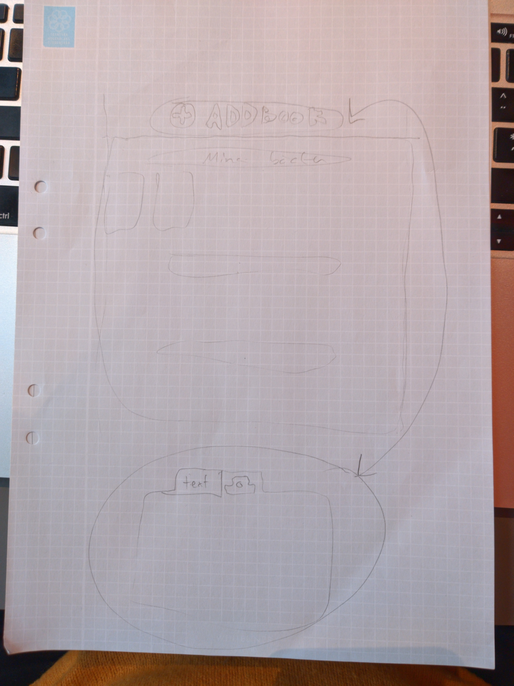
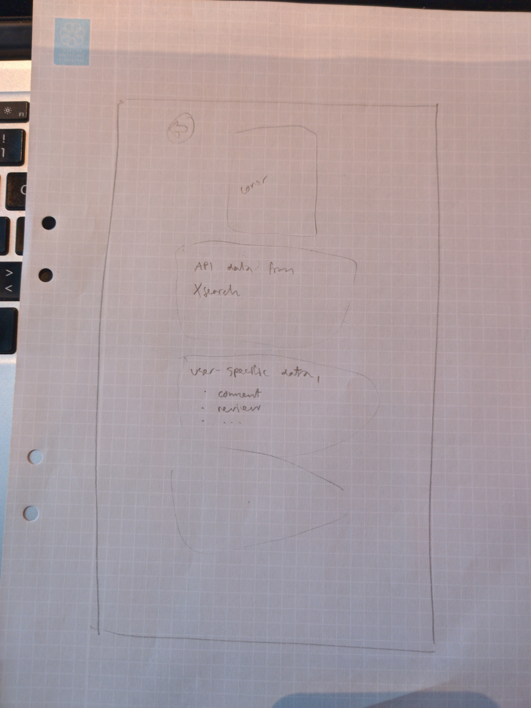

# bookbook

## Project link
https://bookbook-dh2642.firebaseapp.com/

## Project description
Project within course DH2642 on KTH (Royal Institute of Technology) whose aim is for course participants to form a project group and create a single-page web application. 

Our app? Bookbook! The elevator pitch is: create your own digital library out of your existing physical one!

### Technologies
The web app's pages will be built using Vue + Vuetify. Firebase will take care of hosting, database management and authentication. 

### API's
Our app minimum viable product (MVP) is: add book to your own library by search. This will be made possible by one or all of following API's: 
1. [Xsearch](http://librishelp.libris.kb.se/help/xsearch_swe.jsp) 
2. [Google Books API](https://developers.google.com/books/)
3. [Open Library API](https://openlibrary.org/developers/api)
Unfortunately the first does not provide any cover images, which is why we need to find these in the latter two or as a last resort crawl google images.

When our MVP is up and running, we will be working on our killer feature: barcode-scanning! This will be made possible by 

1. [HTML5 getUserMedia API](https://developer.mozilla.org/en-US/docs/Web/API/MediaDevices/getUserMedia) for getting access to video stream on user's device.
2. [QuaggaJS](https://serratus.github.io/quaggaJS/) for barcode recognition. 

### Mockups
For new or not logged in users there's the "welcome, join/log in" splash screen: 


If the user is logged in however, or if the user just registered, the screen below will be shown. There's a library view, with a big 'ol search button on the top, the clicking of which will in turn by CSS animation magic present the search view.  



The user of course has its own library view, in which s/he can set categories ("want to read", "my books", "lent books") which provides a search-as-you-type interface on top: 


Each book can be clicked in order to present book details. This view will be rendered by the app's state: if the book is already added to a user's library, s/he'll see his/her own review, if not, there will be add button. 



## Project setup
```
npm install
```

### Compiles and hot-reloads for development
```
npm run serve
```

### Compiles and minifies for production
```
npm run build
```

### Run your unit tests
```
npm run test:unit
```

### Lints and fixes files
```
npm run lint
```

### Customize configuration
See [Configuration Reference](https://cli.vuejs.org/config/).
